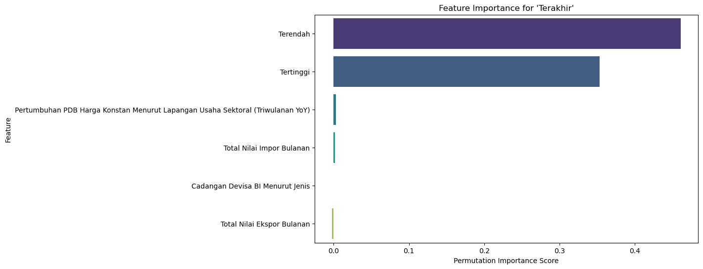
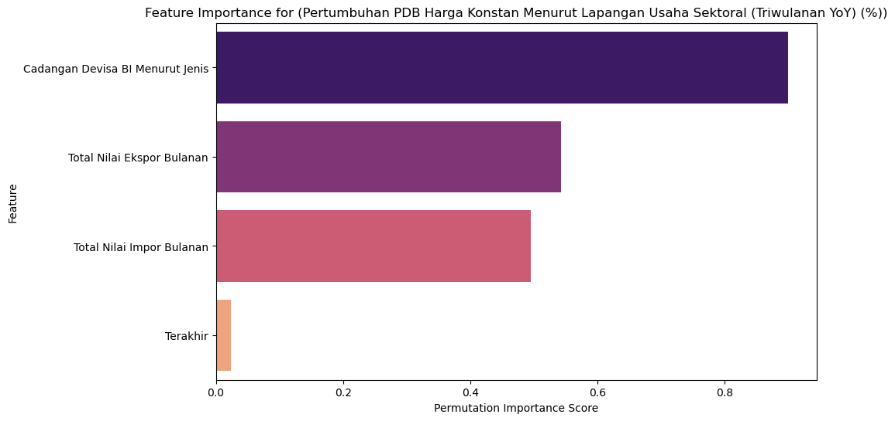
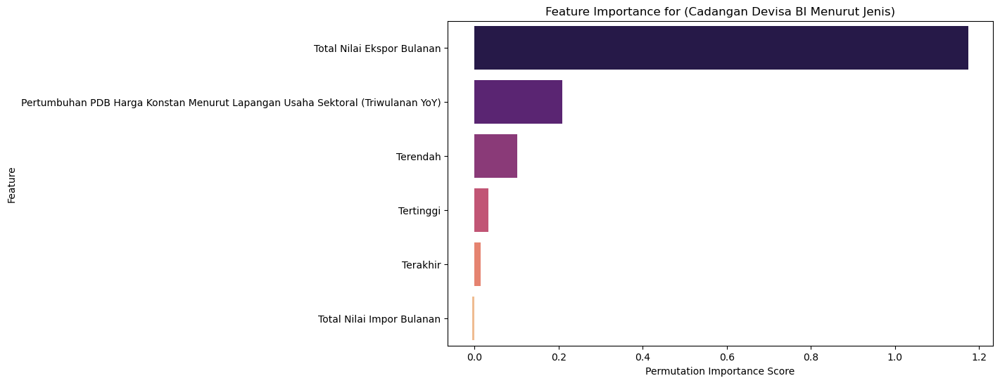

# Macroeconomics_Insights

## Pendahuluan

Dalam ekonomi global yang dinamis saat ini, pemahaman tentang interaksi antara faktor-faktor makroekonomi dan dinamika perdagangan sangat penting untuk pengambilan keputusan yang efektif. Proyek ini berfokus pada analisis indikator makroekonomi dan keuangan utama yang mempengaruhi perdagangan di Indonesia. Dengan memanfaatkan dataset time-series yang komprehensif, tujuan proyek ini adalah untuk mengungkap wawasan mengenai bagaimana variabel ekonomi seperti pertumbuhan PDB, cadangan devisa, dan neraca perdagangan berinteraksi dengan kinerja pasar keuangan.

Dataset ini berasal dari sebuah database yang terdiri dari 120 observasi bulanan yang tersebar dalam 8 kolom berbeda. Observasi-observasi tersebut mencakup serangkaian indikator ekonomi vital, antara lain:

- **Indikator Makroekonomi:**
  - **Cadangan Devisa BI Menurut Jenis:** Mencerminkan stabilitas keuangan Indonesia, indikator ini mencatat cadangan devisa dalam jutaan USD.
  - **Pertumbuhan PDB Harga Konstan Menurut Lapangan Usaha Sektoral (Triwulanan YoY):** Mengukur pertumbuhan PDB secara tahunan pada basis triwulanan, menyoroti periode ekspansi dan kontraksi ekonomi.

- **Indikator Perdagangan:**
  - **Total Nilai Ekspor Bulanan:** Menangkap dinamika kinerja ekspor Indonesia.
  - **Total Nilai Impor Bulanan:** Mewakili besaran impor dan neraca perdagangan secara keseluruhan.

- **Indikator Pasar Keuangan:**
  - **Nilai Penutupan, Tertinggi, dan Terendah (Terakhir, Tertinggi, dan Terendah):** Nilai-nilai ini memberikan gambaran tren pasar keuangan selama periode yang diamati.

## Feature Importance

# Interpretasi

## A. Interpretasi:

1. **“Terendah” dan “Tertinggi”:**
   - **Mengapa Mereka Paling Tinggi:**
     
     Dalam banyak data keuangan, nilai penutupan (Terakhir) secara inheren dibatasi oleh nilai terendah dan tertinggi pada periode tersebut. Fakta bahwa kedua fitur ini memiliki skor tertinggi menunjukkan bahwa model sangat bergantung pada informasi rentang harga.
   
   - **Alasan Ekonomi:**
     
     Nilai penutupan biasanya berada di antara nilai terendah dan tertinggi. Dengan demikian, kedua fitur ini secara langsung menentukan kisaran di mana nilai penutupan dapat berada.
     
2. **Pentingnya yang Rendah dari Indikator Makroekonomi dan Perdagangan:**
   - Fitur seperti Pertumbuhan PDB, Impor, Ekspor, dan Cadangan Devisa memiliki skor yang sangat rendah atau bahkan negatif. Ini menunjukkan bahwa untuk memprediksi nilai penutupan pasar keuangan, indikator makro dan perdagangan tidak memberikan kontribusi informasi yang signifikan.
      - **Alasan:**
      
        Hubungan Tidak Langsung: Indikator makroekonomi cenderung mempengaruhi tren pasar dalam jangka panjang, sedangkan nilai penutupan lebih mencerminkan pergerakan harian atau periodik.

---

## B. Interpretasi:

1. **Pentingnya Cadangan Devisa yang Tinggi:**
   - **Mengapa Paling Dominan:**
     
     Model menunjukkan bahwa cadangan devisa memiliki pengaruh paling kuat dalam memprediksi pertumbuhan PDB. Hal ini masuk akal karena cadangan devisa merupakan indikator kunci dalam menilai stabilitas ekonomi dan kemampuan negara menghadapi guncangan eksternal.
     
   - **Keterkaitan Ekonomi:**
     
     Cadangan devisa mencerminkan kesehatan ekonomi dan kredibilitas finansial suatu negara, yang pada akhirnya berdampak pada pertumbuhan PDB. Posisi cadangan yang kuat biasanya menunjukkan manajemen ekonomi yang baik dan kepercayaan pasar.

2. **Importance dari Indikator Perdagangan (Ekspor dan Impor):**
   - **Skor yang Cukup Tinggi:**
     
     Baik nilai ekspor maupun impor memiliki kontribusi yang signifikan (masing-masing sekitar 0.54 dan 0.49).
     
   - **Alasan Ekonomi:**
     - **Ekspor:** Secara langsung meningkatkan pendapatan nasional dengan membawa devisa asing dan mendongkrak produksi, sehingga sangat berperan dalam mendorong pertumbuhan ekonomi.
     - **Impor:** Walaupun merupakan arus keluar, volume impor mencerminkan skala aktivitas ekonomi dan permintaan konsumen. Pengaruhnya bisa jadi menangkap aspek neraca perdagangan yang mempengaruhi pertumbuhan PDB.

3. **Kontribusi Rendah dari Indikator Keuangan (“Terakhir”):**
   - **Mengapa Rendah:**
     
     Nilai penutupan suatu aset keuangan (Terakhir) lebih menggambarkan sentimen pasar jangka pendek dan tidak memberikan gambaran yang kuat mengenai faktor-faktor fundamental yang mempengaruhi pertumbuhan ekonomi secara keseluruhan.

---

## C. Interpretasi:

1. **Ekspor sebagai Prediktor Dominan:**
   - **Mengapa Paling Tinggi:**
     
     Nilai ekspor adalah fitur yang paling penting dalam memprediksi cadangan devisa. Secara ekonomi, ekspor merupakan sumber utama masuk devisa asing, yang secara langsung meningkatkan cadangan devisa suatu negara.
     
   - **Logika Ekonomi:**
     
     Dengan ekspor sebagai sumber pendapatan eksternal utama, skor tinggi ini menegaskan peran fundamental ekspor dalam meningkatkan cadangan devisa.

2. **Peran Moderat Pertumbuhan PDB:**
   - **Kontribusi yang Signifikan:**
     
     Pertumbuhan PDB juga memiliki peran penting (skor sekitar 0.209190) karena ekonomi yang tumbuh cenderung menghasilkan neraca perdagangan yang lebih baik dan mendukung peningkatan cadangan melalui kekuatan fiskal yang lebih besar.
     
   - **Interpretasi:**
     
     Meskipun tidak sekuat ekspor, pertumbuhan PDB memberikan konteks ekonomi yang lebih luas yang berdampak pada akumulasi cadangan.

3. **Kontribusi yang Kecil dari Indikator Keuangan (Terendah, Tertinggi, Terakhir):**
   - **Mengapa Skor Rendah:**
     
     Fitur-fitur yang mencerminkan nilai pasar keuangan (rentang harga dan nilai penutupan) kurang langsung berhubungan dengan posisi cadangan devisa negara.
     
   - **Alasan:**
     
     Skor yang rendah (antara 0.013852 hingga 0.101145) menunjukkan bahwa meskipun ada korelasi antara tren pasar keuangan dan cadangan, kontribusi informasinya jauh lebih kecil dibandingkan data perdagangan.

4. **Nilai Negatif pada Total Nilai Impor Bulanan:**
   - **Mengapa Negatif:**
     
     Skor negatif menunjukkan bahwa ketika fitur impor diacak, performa model sedikit meningkat.
     
   - **Interpretasi:**
     
     Potensi Kebisingan: Data impor mentah mungkin menambah kebisingan atau redundansi, terutama jika pengaruh impor pada cadangan sudah tercermin lewat data ekspor.
